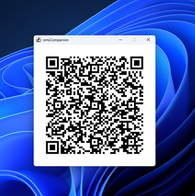

# omsCompanion
The supplementary desktop software for [OneMoreSecret](https://github.com/stud0709/OneMoreSecret).

### Disclaimer
This is a very early version of the software. Use it at your own risk.

## Setting Things Up
This software requires Java Runtime Environment 8 or later. Download and unzip the release into a folder. If you have your Java runtime on your class path, use `oms.cmd` to start the application. It will appear in your system tray.

### Creating Your Private Key
Open the context menu from the system tray icon and click on *Cryptography... -> New Private Key*. The wizard will guide you through the process.

*Store Public Key for later use* checkbox - this will copy your public key to the subfolder */public* within the app folder, so that you can encrypt data with this key on your PC.

**Store the generated HTML file in a secure location or print it out**. Also do not forget to remember the transport password - you will need it to import your private key into the phone, so the next time you will be using it may be in a couple of years from now. 

### Importing the private key.

The key generation wizard will show you the sequence of QR codes to be scanned with *OneMoreSecret* app immediately after you click on *Create*. Please refer to *OneMoreSecret* documentation for the import procedure.

## Encrypting Data
If you double click on the tray icon, omsCompanion will check the clipboard for text. If the text starts with `oms00_`, the QR codes for decryption will be generated (see below). Otherwise, the text will be encrypted with your public key and copied back to the clipboard. A sample result is:

`oms00_MQlSU0EvRUNCL1BLQ1MxUGFkZGluZwlta1g4cHdYanNtT2FSSkl2dHRuZUJUTEVBUHA3dHY4QVorMkZmT0J5dVZzPQlBRVMvQ0JDL1BLQ1M1UGFkZGluZwlRYlB6L2hBTVlDVzFJL1VQMTdlWGZRPT0JcTltaDI3aHIvVWtNUE84NnNsa0ZpZjdCRy9Bb1FsYTBUYWtkbXdRcWtKY2ZEL1VjOFBFaUN0Y041Uy8yeFhsdm9jYkV0SUtyRmkwMzQrd2FrbUJqejRETXdkV01VQ2pGSnpVVDNUUFN6WnZ1Z2lIdVkxYlczYVAxNU5LWE50eGNIZkl3cUZHOWF5M0VSREhIbm4zSEVLWjYyN3RsRHpJZHlBcHA5WlduQXNXQTF4QTdaZUNUTzBBTG5XSmtMVTNPTHNVNkIrSk1kZzNWaVM1ckZZQ0E4TkFHLzZWcytYRHpTK1gzZFIvY3dWOEFXRE9Mc3k5TVE4bXN5eWljUExvT1V2aGI4b2pSTDh4TVV3ZmZXb2loWWg0SWFnRzF4YmRES0M4WlJNViswUmNzaUZZaTZOaitLSGphajM4YllDM3RDWEdlZi9IK01CSGhtZ0lhK0VoZ1ZBPT0JQXZqakE3TFRzQzVPbjFtK0hqSi9qdHVJbWVjemVON0tHN0V4TW5CeEQyMXFua2sxY1ZndnVyMGRyeEpLOEw4ZkRKK3FoeDR2M0t4MXN3ZHBzY0N2Tk53V0dIS3pQWVJtR3VlWmEwZTVWeVU9`

In addition to the text format, you can also generate an animated `.gif` file or a BASE64 encoded `GIF` data, which is useful if you want to embed the image into the `` tag (replacing `...` with the BASE64 encoded data).

## Decrypting Data
*omsCompanion* is continuously monitoring your clipboard (you can disable this feature by clicking *Monitor clipboard* in the context menu of the tray icon). If it finds a text starting with `oms00_`, it will generate an QR code sequence out of it, empty the clipboard and show a pop-up window:

You can also scan the `.gif` files created earlier by the encryption dialog.

For more information on decripting see *OneMoreSecret* documentation. 