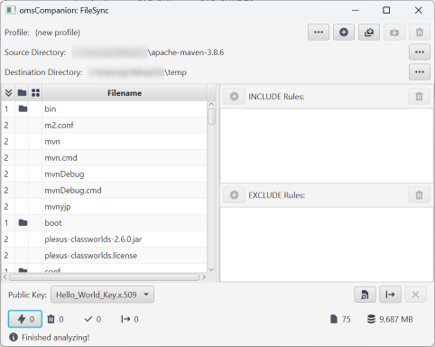
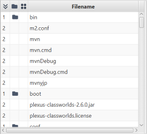
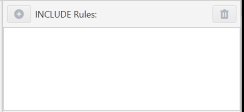
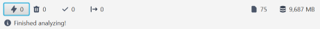

# FileSync - Maintain an Encrypted Mirror of Your Files

TLDR: see [Actions](#actions).

## Use Case
⚠️ THIS IS NOT A BACKUP TOOL! ⚠️

If you want to have some sensitive files at your fingertips (e.g. on your smartphone), your will probably consider storing a copy of those files in the cloud. Unfortunately, cloud providers sniff around in your files (and don't even conseal it) - on the one hand they want to provide full search capability to you (whether you need it or not), on the other hand they will try to prevent you from distributing unlicensed copyrighted material, train their GPT models on your data without asking you etc. If you don't want that, you'll probably try to use things like [BoxCryptor](https://www.boxcryptor.com/) or [CryptSync](https://tools.stefankueng.com/CryptSync.html) (to name a few). 

Before I wrote FileSync, my setup was a combination of BoxCryptor and [FreeFileSync](https://freefilesync.org/) in the mirroring mode. 

So here's a quick check list to see FileSync is a fit:
- you have some data, and you want an encrypted copy of it in the cloud.
- if you access the cloud copy of your files, you need **one or two** files at a time. (This is the current limitation of the decryption functionality of *OneMoreSecret*, as this is the only way to decrypt your files)

Think of a collection of E-Books or your document archive as an ideal use case. 

⚠️ It is a good idea **NOT TO CHANGE** files in the destination folder. FileSync will not monitor the destination folder for changes.

## Features
- Mirror the contents of a source folder to a destination folder encrypting the files on the fly.
- Maintain an internal list of file hashes - and therefore mirror only files that have changed since the latest run.
- You can define inclusion and exclusion lists (e.g. you don't want desktop.ini files in your mirror)

That's basically it...

## How it works

You can access FileSync from the task bar symbol of *omsCompanion*.

### Profile controls

Left to right:
- open profile
- new profile (discard current settings)
- save as
- save
- delete profile

### Directory settings

Source and Destination directories. 

⚠️Both directories need to be defined prior to scanning (see [Status Bar](#status-bar)).

### Source Files

...yes, you are right, it's a completely wrong screenshot for the described [use case](#use-case), I just needed a sample folder structure. 

Columns (left to right):
- Depth (how deep you are into the source directory)
- Folder symbol
- Mirror status (shown while synchronizing folders)
- Filename (see tool tip for the file path relative to the source / destination directory)

### Inclusion and Exclusion Lists

If you select an item in the [source file list](#source-files), you can use this entry to add an inclusion / exclusion rule. 

⚠️If an inclusion rule is defined, it will be processed first. 

A rule is a file path with wildcards '*' (to match anything) or '?' (to match one character) where required. Here are some examples:
- *.pdf will match all PDF files
- foo\\*.pdf - all PDF files in directory 'foo' where 'foo' is a **subfolder of the source directory**.
- *\\foo\\T*.pdf - all PDF files with names starting with T, being within directory 'foo'.'foo', on the other hand, can be located **anywhere** within the source directory.

### Actions

Here is the typical workflow (otherwise you simply load an expisting configuration file):
- Define [source and destination directory](#directory-settings)
- Specify the key for the encryption. 
- (now you can save the configuration, if it is a new one)
- Start directory analysis (1st button in the screenshot above). This will populate the [source file list](#source-files).
- (now you can add some inclusion / exclusion [rules](#inclusion-and-exclusion-lists))
- Start mirroring (2nd button). The status of a file will be added to the source file list (see tool tips!).
- Once you are done, you can close the window (you will probably want to save your configuration file, if not yet done)

### Status Bar

Left to right:
- Error count (you can toggle this one on or off to display only files that could not be processed)
- Number of deleted files. Files, that were present in your source directory, but were deleted since the last sync, will be removed from the destination directory with the next sync.
- Number of unchanged files. Files, that have not changed since the last sync. (TMI: FileSync configuration contains the latest hash sums of the source files and compares against them. Therefore, once again: ⚠️ DO NOT MODIFY FILES IN THE DESTINATION FOLDER)
- Number of mirrored files (i.e. encrypted and copied to the destination folder, either new or changed)

Right side:
- Number of (remaining) files to process.
- Total (remaining) file size to process.
