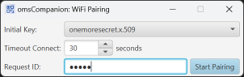
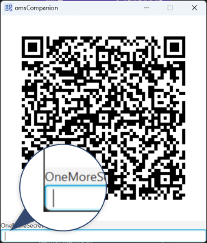
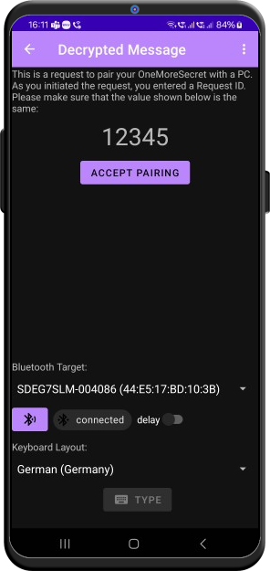
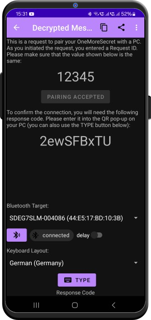

# WiFi Pairing

At times, you have to log in into multiple systems one after another (or some folks require you to log into VPN, then onto a PC, and then into an application - all with a different password, 2FA or whatever). This has never been very user-friendly, and neither it is with *omsCompanion*. However, here's a trick how to avoid scanning the barcode for every password: WiFi Pairing. 

## How it works

If your PC running *omsCompanion* and your smartphone with *OneMoreSecret* share the same local network, why not send data via that network? For this, you have to pair your smartphone and your PC first. The pairing process is based on asymmetric cryptography and is only valid while *omsCompanion* is running (in *OneMoreSecret* the pairing is valid for 12h). And yes, it's as simple as scanning a QR code. 

## Pairing Procedure

After right-clicking the system tray icon of *omsCompanion* and choosing *WiFi Pairing* - *Connect* you will see the following pop-up:

- *Initial key* protects the pairing configuration, so that it can be sent to your smartphone in a secure way.
- *Timeout Connect* is how long *omsCompanion* will try to send data to your smartphone.
- *Request ID* is an arbitrary piece of text. It will be displayed in *OneMoreSecret* as an additional security measure. In this example, I have entered `12345`.

When you click *Start Pairing*, a QR pop-up will be shown:

 Scan the code with *OneMoreSecret*, and you will se the following:

*OneMoreSecret* has received all settings required to set up the connection (a pair of keys that will secure this particular connection). `12345` shown here is the request ID entered in *omsCompanion*. Press *Accept Pairing* after you have verified it. 

Now the connection will be activated. Only one active connection is allowed, and it goes from your PC to your phone. So *omsCompanion* still needs to know where to connect to. This information comes as a code that you can *Auto-Type* into the text field of the QR code dialog (or you can type if by hand):

The code contains the IP address and the port where *OneMoreSecret* is listening for incoming connection.

## Operation

With pairing, no QR codes will be displayed on your PC any more. When [QR scanner](https://github.com/stud0709/OneMoreSecret/blob/master/qr_scanner.md) is active, it is also listening for the network data in the background. 

In most cases, you will see no difference when decrypting data. For [file decryption](README.md#decrypting-files) the AES key will be sent to *omsCompanion* via network (this makes the whole thing faster and more convenient).

## ⚠️ Some Things To Keep In Mind And Troubleshooting
- The network connection is **only** alive when [QR scanner](https://github.com/stud0709/OneMoreSecret/blob/master/qr_scanner.md) is active. 
- With pairing, you can still scan barcodes if needed.
- *OneMoreSecret* keeps the connection data for 12 hours. 
- If you exit *omsCompanion*, you will have to re-establish WiFi Paring if needed.
- When pairing is set up, *WiFi Pairing enabled* will appear in the camera preview of the QR scanner. 
- If you have to switch *omsCompanion* back to the QR mode, click on *WiFi Pairing -> Disconnect* on the system tray menu. You can re-establish the connection later as described [above](#pairing-procedure).